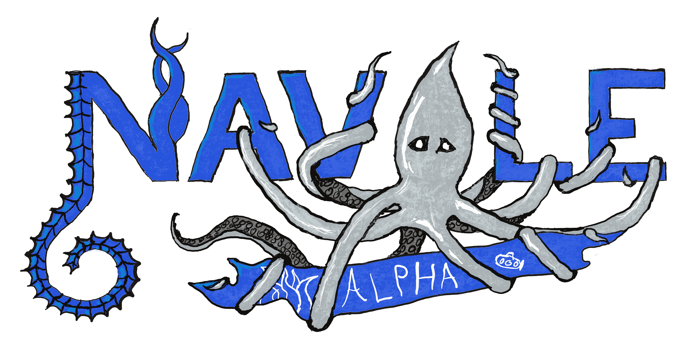

# Qu-est que c'est ?
C'est une application déstinée à héberger des jeux de société dématérialisés.

:calendar: A l'heure actuelle Anovel est une implémentation de la bataille navale.

# Petite histoire
C'est un projet qui a débuté à la fin du mois du novembre 2021 et qui consistait à implémenter une **bataille navale** (le célèbre jeu de plateau) en python, avec une interface graphique.

Aujourd'hui, septembre 2022, le projet a évolué et les enjeux ne sont plus les mêmes. Désormais le but est de créer un jeu de plateau virtuel s'inspirant de certains mécanismes de la bataille navale mais en revisitant le concept pour le rendre plus tactique et stratégique.

# Comment y jouer ?
1. Télécharger le zip de la dernième mise à jour *(v0.1.14 ou ultérieur)* ou de la version en cours de développement **(:warning: risque de bugs :warning:)**.
2. Dézipper le dossier du jeu.
3. Ouvrir le fichier **anovel.py** ou **Navale.py** (selon la version) avec un ide ou l'interpréteur Python.
4. Télécharger les bibliothèques **pyray** et **raylib** pour python avec les commandes:

        pip install pyray
        pip install raylib

5. Exécuter le fichier avec l'icône *play* d'un interpréteur ou avec un terminal.

## Important :warning:

Bien qu'en version **alpha**, Anovel est utilisable sur Windows, Linux et MacOs. Cependant, il faut que **Python 3.8** ou version plus récente soit installé sur votre ordinateur (non fourni avec).

---

# Feuille de route

## Alpha 0.1.x :heavy_check_mark:
- Création de la structure principale.
- Elaboration d'une charte graphique.
- Création d'une bataille navale.

## Alpha 0.2.x :fire:
- Suppression de la bataille navale. :fire:
- Création d'un nouvel éditeur. :heavy_check_mark:
- Création des paramètres. :heavy_check_mark:
- Création d'un nouveau jeu. :fire:
- Création d'un installateur.
- Et bien d'autres améliorations.

## Alpha 0.3.x
- Création du multijoueur "semi-local".
