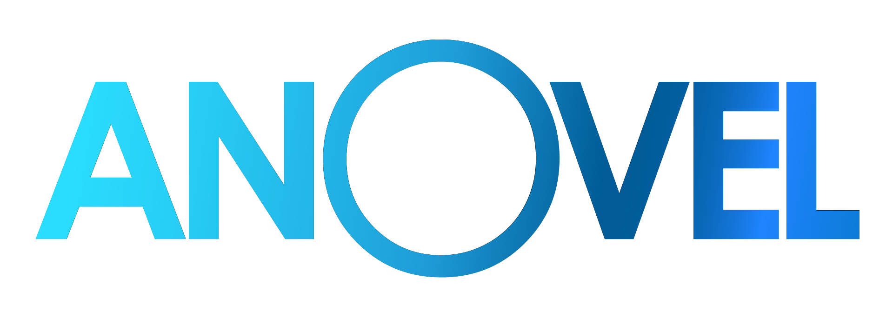

# Qu'est-ce que c'est ?
C'est un jeu vidéo composé de jeux de société dématérialisés.

# Petite histoire
C'est un projet qui a débuté à la fin du mois du novembre 2021 et qui consistait à implémenter une **bataille navale** (le célèbre jeu de plateau), en python, avec une interface graphique.

Aujourd'hui, septembre 2023, le projet a évolué pour créer **Anovel** Un jeu plus grand regroupant la bataille navale et ***Archipel***, un nouveau jeu.

# Comment y jouer ?
1. Télécharger le zip de la dernième mise à jour *(v0.2 ou ultérieur)* ou de la version en cours de développement *(beta)*.
2. Dézipper le dossier du jeu.
3. Ouvrir le fichier **anovel.py** avec un ide ou l'interpréteur Python.
4. Télécharger les bibliothèques **pyray** et **raylib** pour python avec les commandes:

        pip install pyray
        pip install raylib

5. Exécuter le fichier avec l'icône *play* d'un interpréteur ou avec un terminal.

## Important :warning:

Bien qu'en version **alpha**, Anovel est utilisable sur Windows, Linux et MacOs. Cependant, il faut que **Python 3.8** ou version plus récente soit installé sur votre ordinateur (non fourni avec).
